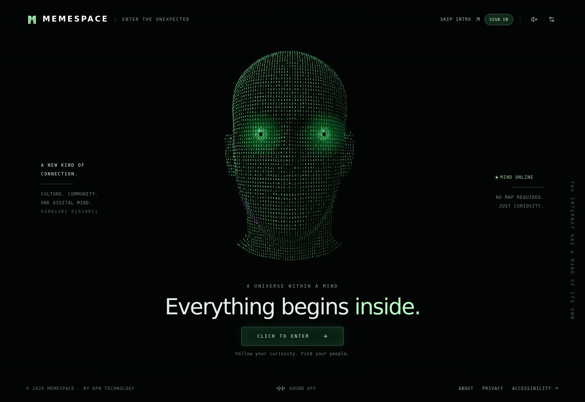
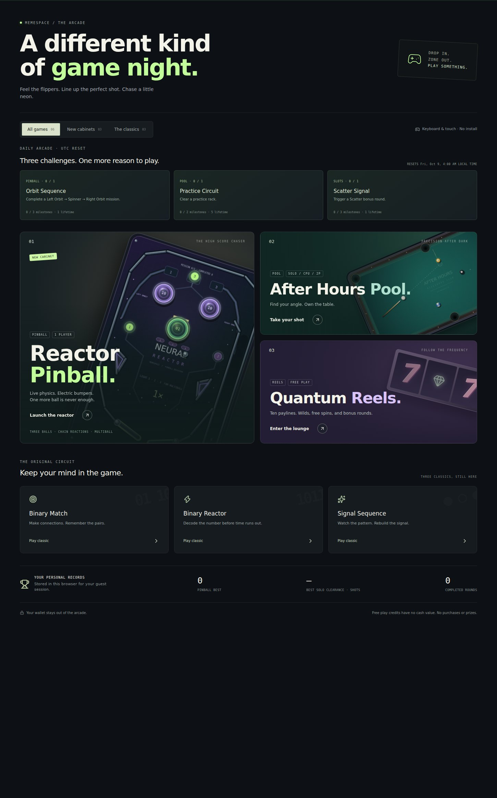
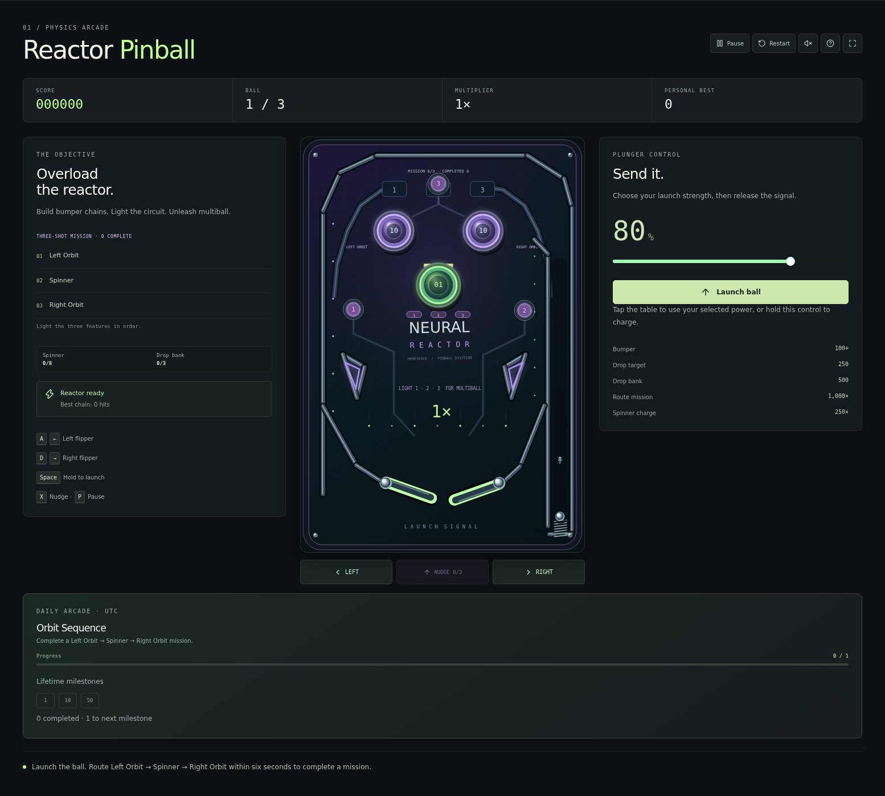
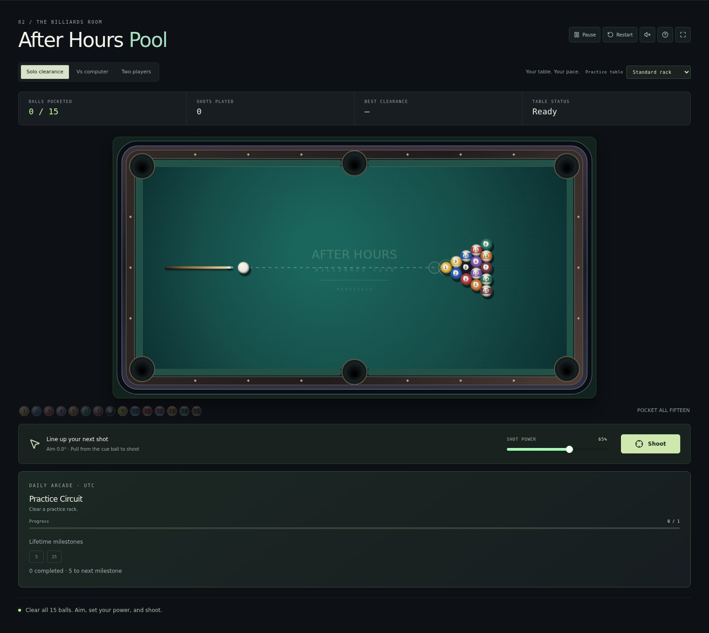
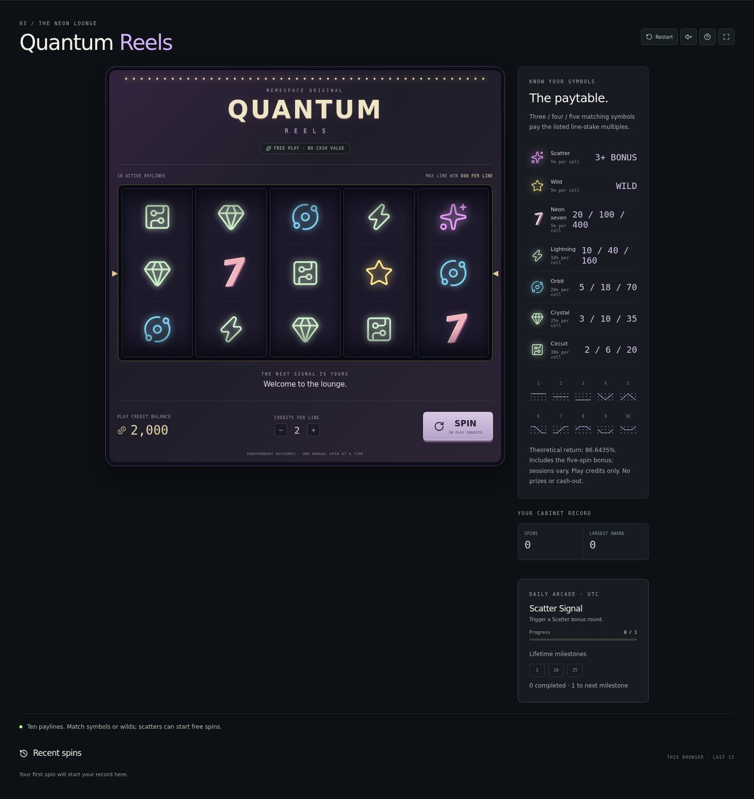
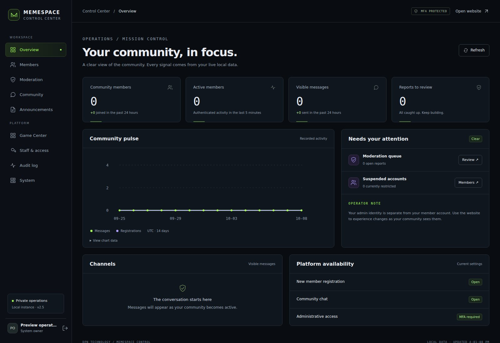
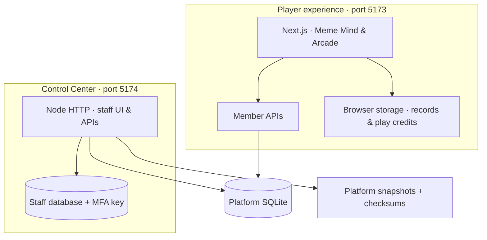

<!-- DPN-REPO-HERO:START -->
<p align="center">
  
</p>
<!-- DPN-REPO-HERO:END -->

<h1 align="center">MemeSpace</h1>
<p align="center"><strong>A digital mind. A community. An arcade worth coming back to.</strong></p>
<p align="center">Explore an interactive binary head and brain, make and share memes, and play six arcade cabinets — with a separate Control Center behind the scenes.</p>

<!-- DPN-LIVE-STATUS:START -->
<p align="center">
  <a href="https://github.com/DPN-Technology/MemeSpace/actions/workflows/ci.yml"></a>
  <a href="https://github.com/DPN-Technology/MemeSpace/actions/workflows/security-gate.yml"></a>
  <a href="https://github.com/DPN-Technology/MemeSpace/releases"></a>
  <a href="package.json"></a>
</p>
<!-- DPN-LIVE-STATUS:END -->

<p align="center">
  <a href="#quick-start"><strong>Get started</strong></a> ·
  <a href="#inside-memespace"><strong>Explore</strong></a> ·
  <a href="#neon-arcade"><strong>Play</strong></a> ·
  <a href="#control-center"><strong>Operate</strong></a> ·
  <a href="#development"><strong>Develop</strong></a> ·
  <a href="docs/local-operations.md"><strong>Operations guide</strong></a>
</p>

> **Current source:** this README describes `main`, including the latest arcade improvements. For a downloaded version, follow its [release notes](https://github.com/DPN-Technology/MemeSpace/releases). The supported runtime is local Node.js 24+, Next.js and native SQLite.

## Quick start

### Windows

Install **Node.js 24 or newer**, then download a [release](https://github.com/DPN-Technology/MemeSpace/releases) or clone this repository. Extract/open the folder containing `package.json`.

| Step | Open | What happens |
| --- | --- | --- |
| **01 · Prepare** | [`SETUP-WINDOWS.cmd`](SETUP-WINDOWS.cmd) | Installs the locked dependencies and prepares the local database. |
| **02 · Enter** | [`START-WINDOWS.cmd`](START-WINDOWS.cmd) | Starts MemeSpace at **http://localhost:5173/**. |
| **03 · Operate** | [`START-ADMIN-WINDOWS.cmd`](START-ADMIN-WINDOWS.cmd) | Starts the separate Control Center at **http://127.0.0.1:5174/**. |

For first-time administration, use the **setup code printed in the admin terminal**, choose **Set up access**, and enroll a staff identity with an authenticator. Save the recovery codes. Keep each terminal open while its app is running; **Ctrl+C** stops it.

### macOS / Linux / terminal

Run from the repository root:

```sh
node scripts/local.mjs setup
node scripts/local.mjs start
```

For Control Center, open a second terminal in the same folder:

```sh
node admin/server.mjs
```

Setup runs the pinned pnpm version through npm. You need npm registry access for the first install; no paid API key is required. Member accounts and staff accounts are separate, and there is no default admin password.

**Already have MemeSpace?** Follow the [upgrade guide](docs/local-operations.md#upgrade-without-losing-data) before setup to preserve your database, admin access and MFA key. For port changes, sign-in issues or recovery, use [troubleshooting](docs/local-operations.md#troubleshooting).

<!-- DPN-REPO-SHOWCASE:START -->
## Inside MemeSpace

<p align="center"></p>

| Experience | What you can do |
| --- | --- |
| **The Meme Mind** | Enter through the animated binary head, navigate the brain, and open modules for meme history, memecoin history and crypto education. |
| **Community & identity** | Join four rooms, search stored conversations, browse older messages and focused replies, react, edit, report and keep a separate draft in each room. Manage your local account and read operator-published announcements. |
| **Reading room** | Explore 12 culture stories and 7 memecoin field guides with outlines, practical examples, source links, full-text search and a saved reading list. |
| **Media & learning** | Create and save meme edits. Follow 9 lessons with practical exercises, explanatory knowledge checks, saved progress and personal notes. |
| **Neon Arcade** | Play six cabinets, chase personal records, and complete local daily challenges and lifetime milestones. |
| **Wallet connection** | Connect a compatible Solana/Phantom extension to display its public address. The app does not transfer funds. |
| **Control Center** | Manage members, moderation, announcements, cabinet availability, staff access, backups and audit history. |

See the [community and learning guide](docs/community-and-learning.md) for the new conversation, reading and progress controls.

### A look inside

<table>
  <tr>
    <td width="50%"><a href=".github/readme/entry.jpg"></a><br><strong>Enter the mind</strong><br><sub>The immersive public entry.</sub></td>
    <td width="50%"><a href=".github/readme/arcade.jpg"></a><br><strong>Choose your cabinet</strong><br><sub>Six games in one arcade lobby.</sub></td>
  </tr>
  <tr>
    <td width="50%"><a href=".github/readme/pinball.jpg"></a><br><strong>Reactor Pinball</strong><br><sub>Shot sequences, missions and multiball.</sub></td>
    <td width="50%"><a href=".github/readme/pool.jpg"></a><br><strong>After Hours Pool</strong><br><sub>Drag the cue, release the shot.</sub></td>
  </tr>
  <tr>
    <td width="50%"><a href=".github/readme/slots.jpg"></a><br><strong>Quantum Reels</strong><br><sub>Ten paylines, wilds and free-spin bonuses.</sub></td>
    <td width="50%"><a href=".github/readme/control-center.jpg"></a><br><strong>Behind the experience</strong><br><sub>A separate workspace for operators.</sub></td>
  </tr>
</table>

Screenshots show the actual app on a fresh local database. Open an image for full size; [capture details and source revision](.github/readme/manifest.json) are included.
<!-- DPN-REPO-SHOWCASE:END -->

<!-- DPN-REPO-DETAILS:START -->
## Neon Arcade

Open **Game Center** inside the brain, or go to **http://localhost:5173/#games** while the public app is running.

| Cabinet | Depth & replayability | Main controls |
| --- | --- | --- |
| **Reactor Pinball** | Three-ball rounds; orbit lanes, spinner and physical drop-target bank; timed shot missions; earned multiball; ball saves; nudge and tilt. | **A / ←** and **D / →** flippers; hold/release **Space** to launch; **X** nudge; **P** pause. Touch controls and tap-to-launch are available. |
| **After Hours Pool** | Solo clearance, line-drill and bank-shot practice; eight-ball against three CPU difficulty levels or a second local player; cushion and ball collisions, ghost-ball aiming and called-pocket rules. | **Drag back and release on the table to shoot**. **← / →** aim, **Shift** for fine aim, **↑ / ↓** power, **Space** shoot, **P** pause. Practice layouts apply to solo mode. |
| **Quantum Reels** | Five reels × three rows; ten paylines; seven symbols including wild and scatter; three or more scatters award five free spins with a **1.5×** multiplier; paytable, line highlights and recent results. | **Spin**, **Space** or **Enter**. Choose a wager, inspect the paytable, and refill free credits when the balance is below the selected spin cost. |
| **Binary Match** | A memory-pair challenge inside the original brain-game collection. | Use the on-screen cards. |
| **Binary Reactor** | A reaction challenge from the original brain-game collection. | Follow the on-screen prompts. |
| **Signal Sequence** | A sequence-memory challenge from the original brain-game collection. | Repeat the displayed sequence. |

**Reasons to return:** daily challenges rotate alongside lifetime milestones, and personal records stay with the current guest/member identity in this browser. Pinball and pool provide pause, help and fullscreen controls; sound is opt-in, and reduced-motion preferences simplify effects.

**Play credits stay playful.** Quantum Reels uses free local credits with no cash value, purchases or prizes. Results and credits settle before the reel animation, so a reload cannot replay an award. There is no connection between the slots and the wallet module.

Records, challenges and play credits live in browser storage and do not sync across devices. Use the same browser, website address and member identity to retain them. Pinball rounds and pool racks start fresh when reopened. These are personal records, not a verified global leaderboard.

## Control Center

<p><strong>Separate service. Separate staff identity. One operational view.</strong></p>

Control Center runs independently at **http://127.0.0.1:5174/**. The public Next.js app has no `/admin` interface or privileged admin API.

| Workspace | Operator capabilities |
| --- | --- |
| **Overview & members** | Real activity counts, member search, suspension/restoration and session revocation. |
| **Moderation & community** | Review reports, hide/restore messages and record moderation decisions. |
| **Announcements** | Draft, publish, edit and archive updates shown inside the Meme Mind. |
| **Game Center** | Enable or pause new visits to each cabinet with a required reason and audit entry. |
| **Staff & audit** | Role-based invitations, mandatory authenticator MFA, staff controls and searchable audit history. |
| **System & backups** | Health, migrations, registration/chat switches and integrity-checked platform snapshots. |

Owners, administrators, moderators and observers have different permissions enforced by the APIs. Availability updates reach arcade lobbies within 30 seconds; already open cabinets remain playable for that visit.

**Recovery matters:** platform snapshots do **not** include the separate admin identity database or MFA key. See [roles and MFA](docs/local-operations.md#staff-access-and-mfa) and the [complete backup procedure](docs/local-operations.md#data-backup-and-recovery).

## Architecture



Both services run on loopback and share local platform data. Member sessions and staff sessions are separate. See the [Control Center design](docs/control-center-design.md) for the service boundaries and [operations guide](docs/local-operations.md#runtime-and-security-boundary) for deployment scope.

| Path | Responsibility |
| --- | --- |
| [`app/`](app/) | Public experience, module workspaces and member API routes. |
| [`admin/`](admin/) | Standalone Control Center, authentication, MFA, roles and operations. |
| [`lib/`](lib/) | Local authentication, database helpers and arcade catalog. |
| [`db/`](db/) · [`drizzle/`](drizzle/) | Schema and additive migrations. |
| [`tests/`](tests/) · [`scripts/`](scripts/) | Regression coverage, launchers, backups and security tooling. |
| [`public/`](public/) | Static assets, geometry and retained asset credits. |
| [`.github/`](.github/) · [`docs/`](docs/) | CI, repository governance, design and operational documentation. |

## Development

Run setup first. The repository pins **pnpm 11.25.0** in `package.json`; setup invokes it through npm, so a global pnpm install is optional. There is no npm lockfile: use the committed pnpm lockfile.

| Task | Command |
| --- | --- |
| Start development | `node scripts/local.mjs start` |
| Build | `node scripts/local.mjs build` |
| Serve the production build | `node scripts/local.mjs serve` |
| Start Control Center | `node admin/server.mjs` |
| Full regression suite | `node scripts/local.mjs test` |
| Admin tests | `node --test tests/admin.test.mjs` |
| Arcade engine tests | `node --test tests/arcade.test.mjs tests/arcade-extra.test.mjs` |
| Browser arcade tests | `node --test tests/arcade-ui.test.mjs` |
| Static security gate | `node scripts/security-gate.mjs` |

With the pinned pnpm available, run the repository's standard validation:

```sh
pnpm lint
pnpm typecheck
pnpm test
pnpm build
pnpm security:gate
```

Without a global pnpm command, prefix a pnpm script with `npm exec --yes --package=pnpm@11.25.0 -- pnpm`, for example `npm exec --yes --package=pnpm@11.25.0 -- pnpm typecheck`.

Browser arcade tests require a production build and Playwright Chromium; see [test setup](docs/local-operations.md#build-and-test). The regression suite uses temporary databases. CI and the security workflows validate changes; current results are linked in the badges above. Dependency policy is defined in [`pnpm-workspace.yaml`](pnpm-workspace.yaml).

## Documentation & project care

| Resource | Use it for |
| --- | --- |
| [Local operations guide](docs/local-operations.md) | First admin enrollment, upgrades, roles, MFA, backups, recovery and troubleshooting. |
| [Arcade upgrade design](docs/superpowers/specs/2026-10-07-memespace-arcade-v2-6-design.md) | Design context for the expanded pinball, pool and slots experiences. |
| [Control Center design](docs/control-center-design.md) | Administrative architecture and operational responsibilities. |
| [Identity foundation](docs/identity-foundation-design.md) | Member identity and legacy migration design. |
| [Security policy](SECURITY.md) | Security expectations and vulnerability reporting. |
| [Third-party licenses](THIRD_PARTY_LICENSES.md) | Dependency and asset attribution; retain the geometry credits and license files. |
| [Releases](https://github.com/DPN-Technology/MemeSpace/releases) · [Issues](https://github.com/DPN-Technology/MemeSpace/issues) | Version-specific downloads, release notes, reproducible bugs and feature requests. |

When reporting a bug, include your version/commit, operating system, Node version and steps to reproduce. Keep passwords, setup codes, recovery codes and private data out of reports; use the security policy for vulnerabilities.
<!-- DPN-REPO-DETAILS:END -->

<!-- DPN-ECOSYSTEM:START -->
---

<p align="center"><strong>DPN TECHNOLOGY</strong><br>Develop · Pioneer · Navigate</p>
<p align="center">MemeSpace brings DPN's technical identity into a world of mint light, lavender accents and digital culture.</p>
<p align="center"><a href="https://github.com/DPN-Technology">DPN Technology</a> · <a href="https://github.com/DPN-Technology/DPN-Website">DPN Website</a> · <a href="https://github.com/DPN-Technology/DPN-War-Simulator">DPN War Simulator</a> · <a href="https://github.com/DPN-Technology/DPN-QB-FiveM-Scripts">DPN FiveM</a></p>
<!-- DPN-ECOSYSTEM:END -->
