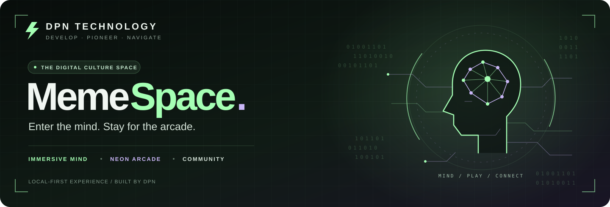
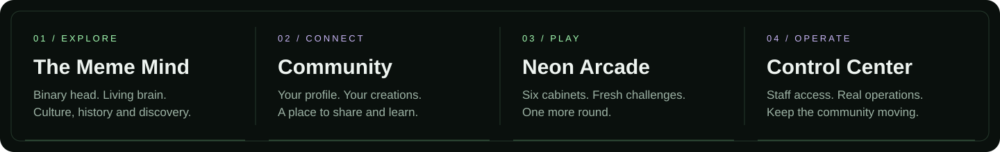
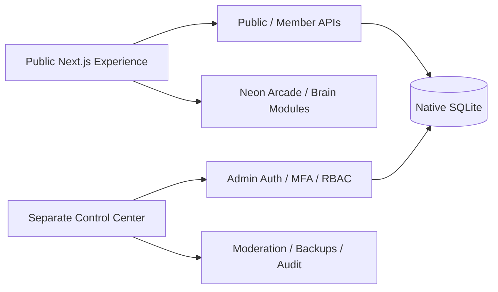

<!-- DPN-REPO-HERO:START -->
<p align="center"></p>
<p align="center">  </p>
<!-- DPN-REPO-HERO:END -->

<!-- DPN-LIVE-STATUS:START -->
<p align="center">
  
  
  
  
</p>
<!-- DPN-LIVE-STATUS:END -->

<!-- DPN-REPO-SHOWCASE:START -->
<p align="center"></p>
<p align="center"><a href="https://github.com/DPN-Technology/MemeSpace/releases"><strong>Releases</strong></a>&nbsp;•&nbsp;<a href="https://github.com/DPN-Technology/MemeSpace/issues"><strong>Issues</strong></a>&nbsp;•&nbsp;<a href="https://github.com/DPN-Technology/MemeSpace/pulls"><strong>Pull Requests</strong></a></p>
<!-- DPN-REPO-SHOWCASE:END -->

<!-- DPN-REPO-DETAILS:START -->

## Product Architecture



## Feature Matrix

| Area | What this repository covers |
| --- | --- |
| **Immersive Experience** | Binary head, glowing eyes, brain navigation and interactive modules |
| **Community** | Identity, chat, reports, moderation and announcements |
| **Arcade** | Six local-first interactive game experiences |
| **Control Center** | Separate admin service with MFA, RBAC, backups and audit |

## Visual Evidence

<table>
<tr>
<td align="center"><br><sub>Binary head</sub></td>
<td align="center"><br><sub>Brain experience</sub></td>
<td align="center"><br><sub>Pinball project capture</sub></td>
<td align="center"><br><sub>Pool project capture</sub></td>
</tr>
</table>

> Visuals above are repository-native assets or verified project captures already committed within the DPN organization. No synthetic runtime screenshot is presented as a real capture.

## Install & Run

| | |
| --- | --- |
| **Primary target** | Local Node.js |
| **Fast path** | Use `SETUP-WINDOWS.cmd` or the documented pnpm scripts for the public app and separate Control Center. |
| **Setup reference** | [Open setup documentation](SETUP-WINDOWS.cmd) |

## Security, Architecture & Release

| Resource | Purpose |
| --- | --- |
| [Security policy](SECURITY.md) | Vulnerability reporting, protected-data guidance and security expectations |
| [GitHub Releases](https://github.com/DPN-Technology/MemeSpace/releases) | Published versions and downloadable release artifacts |

> **Repository presentation rule:** status, release and security claims in this README should stay tied to repository evidence. Visual polish must not imply a capability is production-ready when the underlying project documentation says otherwise.

<!-- DPN-REPO-DETAILS:END -->

<!-- DPN-ECOSYSTEM:START -->

## DPN Ecosystem

**Category:** Simulation & Interactive

[**DPN Website**](https://github.com/DPN-Technology/DPN-Website) · [**DPN QB FiveM Scripts**](https://github.com/DPN-Technology/DPN-QB-FiveM-Scripts) · [**DPN War Simulator**](https://github.com/DPN-Technology/DPN-War-Simulator)

<details>
<summary><strong>Explore the broader DPN Technology platform</strong></summary>

| Control & Infrastructure | Business Operations | Development & AI | Simulation & Interactive |
| --- | --- | --- | --- |
| [DPN Operational Control](https://github.com/DPN-Technology/DPN-Operational-Control) | [DPN One](https://github.com/DPN-Technology/DPN-One) | [DPN AI](https://github.com/DPN-Technology/DPN-AI) | [DPN War Simulator](https://github.com/DPN-Technology/DPN-War-Simulator) |
| [DPN Executive Control System](https://github.com/DPN-Technology/DPN-Executive-Control-System) | [DPN Human Resources](https://github.com/DPN-Technology/DPN-Human-Resources-Software) | [Death the Developer](https://github.com/DPN-Technology/DPN-Death-the-Developer) | [Tool & Die Simulator](https://github.com/DPN-Technology/DPN-Tool-Die-Simulator) |
| [DPN WatchTower](https://github.com/DPN-Technology/DPN-Watch-Tower) | [DPN Workforce](https://github.com/DPN-Technology/DPN-Workforce-Time-Management-System) | [DPN Website](https://github.com/DPN-Technology/DPN-Website) | [MemeSpace](https://github.com/DPN-Technology/MemeSpace) |
| [DPN Network Mapper](https://github.com/DPN-Technology/DPN-Network-Mapper) | [DPN Service Desk](https://github.com/DPN-Technology/DPN-Service-Desk) | [DPN FiveM Resources](https://github.com/DPN-Technology/DPN-QB-FiveM-Scripts) | [DPN Aqua Labs](https://github.com/DPN-Technology/DPN-Aqua-Labs-Point-of-Sale-System) |

</details>

<!-- DPN-ECOSYSTEM:END -->

# MemeSpace v2.5 — Neon Arcade

**MemeSpace** is DPN Technology's local-first immersive community platform: an animated binary head/brain experience, identity and community system, six-cabinet arcade, and a physically separate Control Center for administration, moderation, backups, platform controls, and audit history.

This repository is the authoritative **v2.5** source line. The supported local runtime is **Node.js 24 + Next.js + native SQLite**. The public application and Control Center run as separate loopback services; Wrangler/Workers are not part of the supported launcher path.

## Engineering status

| Area | v2.5 state |
| --- | --- |
| Public immersive UI | Binary head, glowing eyes, brain navigation and interactive modules |
| Identity | Local accounts, password rotation, sessions, export/delete, preserved legacy-owner migration |
| Community | Chat, moderation-aware visibility, reports, announcements and operator switches |
| Arcade | Reactor Pinball, After Hours Pool, Quantum Reels, Binary Match, Binary Reactor, Signal Sequence |
| Control Center | Separate service, MFA, RBAC, moderation, members, announcements, game controls, backups, audit log |
| Persistence | Native SQLite with additive migrations through `0004_neon_arcade.sql` |
| Security baseline | Pinned CI actions, frozen lockfile, dependency quarantine, static security gate, HIGH+ advisory gates |
| Supported exposure | Local/loopback only; public internet deployment requires additional hardening |

## Repository architecture

```text
app/                 Public Next.js experience, identity UI and module workspaces
app/api/             Public/member APIs
admin/               Separate Control Center HTTP service, auth/MFA/RBAC and operations
lib/                 Local auth, sessions, database and arcade catalog helpers
db/ + drizzle/       Database schema and additive migrations
tests/               Public, identity, admin, arcade and startup regression coverage
scripts/             Local setup/start/build/test/backup/security tooling
public/               Static assets and geometry
.github/              CI, security gate, Dependabot, CODEOWNERS and PR governance
docs/                 Architecture/design notes and security documentation
```

## Quality gates

Every change to `main` is expected to satisfy:

```sh
pnpm lint
pnpm typecheck
pnpm test
pnpm build
pnpm security:gate
```

GitHub Actions repeat the same validation on pushes and pull requests, while a separate scheduled security workflow checks repository policy and blocks HIGH/CRITICAL dependency advisories. Exact dependency versions are controlled by `pnpm-lock.yaml`; supply-chain policy lives in `pnpm-workspace.yaml`.

Third-party code and assets are tracked separately from DPN-owned application code in `THIRD_PARTY_LICENSES.md` and the retained vendor/asset license files.

## New: six-cabinet arcade

Open **Game Center** inside the brain, or search for a cabinet by name. The new lobby includes game previews, filters, personal records and the three original brain games.

- **Reactor Pinball:** live ball physics, moving flippers, bumper chains, three-ball rounds, a plunger, target circuits, earned multiball, ball saves, nudges and tilt. A/Left Arrow and D/Right Arrow control the flippers. Hold/release Space to launch; X nudges and P pauses. Touch buttons are below the table. A returned ball can be relaunched with different power without spending a ball.
- **After Hours Pool:** ball collisions, cushions, six pockets, cue placement, a ghost-ball guide and power control. Play solo clearance, against the computer, or two-player pass-and-play. Move/drag on the table to aim; click Shoot or press Space. Left/Right arrows adjust aim, Shift gives finer aim, Up/Down change power, and P pauses. Use the Help button for the eight-ball house rules and called-pocket controls.
- **Quantum Reels:** animated reels, five paylines, five weighted symbols, a complete paytable, winning-line highlights and the latest twelve results. All credits are free local play credits with no cash value, purchases, prizes or wallet connection. Spins settle before animation so reloading cannot replay an award or discard the result. Refill to 2,000 when below the selected spin cost.
- **The classics:** Binary Match, Binary Reactor and Signal Sequence remain available.

Pinball and pool pause when the window loses focus. Sound is opt-in; each cabinet has fullscreen and help controls. Reduced-motion preferences simplify pinball trails and slot animation. Personal records and slot credits are kept in this browser under the current guest/member identity. They do not sync across devices and are not a verified competitive leaderboard. Use the same website address and browser after upgrading to retain them. Opening a new cabinet starts a fresh pinball round or pool rack; these in-progress games do not resume after reload. Play credit history is retained.

The **separate Control Center → Game Center** can pause or enable each cabinet. Changes refresh in open arcade lobbies within 30 seconds. Already open cabinets stay playable for that visit. Owners and administrators can change availability; every change requires a reason and is audited.

## Windows — start here

1. Install **Node.js 24 or newer**, if needed.
2. Extract the ZIP into a new folder. Open the folder containing `package.json`.
3. Double-click **SETUP-WINDOWS.cmd**. First setup downloads the locked dependencies.
4. Double-click **START-WINDOWS.cmd**. Open **http://localhost:5173/** when the terminal says ready.
5. Double-click **START-ADMIN-WINDOWS.cmd** in a second terminal. Open **http://127.0.0.1:5174/**.
6. On the first admin run, copy the **setup code printed in the admin terminal**. In Control Center, choose **Set up access**. Create a staff identity, add the shown key to a time-based authenticator app, verify its six-digit code, and save the recovery codes.

Keep both terminals open. Ctrl+C stops the respective app. The admin app also works while the public site is stopped. There is no default admin password and a website member account does not grant admin access.

The apps run only on your computer. No paid API key, Cloudflare account, Sites account or ChatGPT subscription is needed. First setup needs npm registry access. A compatible extension is needed for the optional wallet connection.

## Upgrade your existing working version

1. Stop the old website and any admin process.
2. Keep the old folder unchanged as a rollback copy.
3. Extract this release into a **new folder**.
4. Copy the **entire old `data` folder** into the new project, alongside `package.json`, before setup. This preserves accounts, profiles, chat, saved stories, lessons and creations. It also preserves existing admin identities and the MFA encryption key.
5. Run setup, then start the website and admin separately.
6. Use the same website address/browser to keep browser preferences. The new migration adds the six cabinet availability settings without deleting existing records.

If your original data still lives under `.wrangler/state/v3/d1`, copy the old `.wrangler` folder before first setup. The launcher imports its database only when `data/memespace.sqlite` does not already exist and keeps the original intact.

### Preserved v2.2 owner

The `local_seedy` member identity and its content remain intact. An existing valid v2.2 cookie can upgrade once before an initial password is set. The previous unauthenticated one-click sign-in shortcut is now closed.

If the browser no longer has that old session and the owner has never set a password, run **CLAIM-LEGACY-OWNER-WINDOWS.cmd** (or `node scripts/claim-owner.mjs`). Enter a password in the local terminal; characters are hidden. Then sign in to the website as `owner@localhost` (or the identifier printed by the command). This only claims an **unclaimed** legacy member identity and does not reset an existing password or create an admin account.

## What the Control Center does

- **Overview:** real member counts, authenticated activity in the last five minutes, visible messages, open reports, fourteen-day activity chart, channel counts and availability switches. No sample activity is inserted.
- **Members:** search, filter, paginate, inspect status, suspend/restore with a reason, and revoke member sessions. Suspension takes effect on the next authenticated request.
- **Moderation:** review reported messages, hide and resolve, dismiss, reopen and record decision notes.
- **Community:** review messages across channels, hide messages and restore them. Hidden messages disappear from public chat and cannot be edited or reacted to through public endpoints.
- **Announcements:** create drafts, publish updates into the Meme Mind, edit and archive. Public updates refresh within 30 seconds; only published records are exposed.
- **Game Center:** six-cabinet catalog with audited enable/pause controls. Player records stay on player browsers; there are no fabricated analytics or global rankings.
- **Staff & access:** email-bound invitations, administrator/moderator/observer roles, mandatory authenticator MFA, disable/enable staff, revoke invitations and end the owner's other sessions.
- **Audit log:** searchable, paginated records with actor, action, target, time, result, source and decision details. Requested actions and completed actions are separate entries. Application-level triggers prevent edits and deletions.
- **System:** public-site reachability, database integrity, migrations, runtime, admin uptime, registration/chat switches and verified database backups. Daily local backups run while the admin service is running.

Every API enforces permissions. Hiding a navigation button is not the authorization boundary.

| Role | Access |
| --- | --- |
| System owner | All controls, infrastructure settings, backups and staff administration |
| Administrator | Overview, members, session revocation, moderation, announcements, game availability and audit |
| Moderator | Overview, members, suspensions and community moderation |
| Observer | Aggregate overview only |

The initial owner cannot be disabled through the panel. Staff invitations expire in one hour; initial owner codes expire in twenty minutes. Restart the admin app for a fresh first-owner code if needed. MFA setup must finish within ten minutes.

## Sign-in and MFA

Member and admin identities, tokens and sessions are separate. Admin passwords use scrypt. TOTP keys are encrypted with a machine-generated key stored in `data/admin/mfa.key`; recovery codes and session tokens are stored as hashes. Admin sessions expire after eight hours or thirty minutes idle. Sign-in and enrollment attempts are limited; repeated credential failures lock the staff identity temporarily.

Keep your authenticator device clock automatic. A code cannot be reused; wait for the next six-digit code after signing out. A saved recovery code can replace an authenticator code **once**, and still requires the password. No email reset service is configured. Preserve your password, authenticator, recovery codes and a private copy of the admin data directory.

Admin requests require the expected local host. Mutations require the exact admin Origin and a session-bound CSRF token. Admin cookies are HttpOnly and SameSite=Strict. The HTTP launcher is loopback-only, so cookie Secure/HSTS require a future HTTPS deployment.

## Included identity and community improvements

- Published community updates inside the brain environment.
- Operator-controlled registration and read-only chat.
- Hidden-message filtering and immediate enforcement of account suspensions.
- Account-specific browser draft keys and workspace remounting on account changes.
- Current-password confirmation before member account deletion.
- Closed legacy sign-in bypass and single-use legacy migration.
- Saved meme edits now update the original creation and retain caption size/color.
- A wider, more usable Identity Center; the scene pauses while it is open.

Stored database content remains available after upgrade. Old unscoped browser-only drafts are not assigned to another account. Newly written drafts are isolated by member identity.

## macOS / Linux

```sh
node scripts/local.mjs setup
node scripts/local.mjs start
```

In a second terminal:

```sh
node admin/server.mjs
```

`./start-admin.sh` also starts the admin service.

## Build and test

```sh
node scripts/local.mjs build
node scripts/local.mjs serve
node --test tests/admin.test.mjs tests/arcade.test.mjs
```

The complete regression suite runs against a temporary database and both applications:

```sh
# macOS / Linux
MEMESPACE_TEST_MODE=serve node scripts/local.mjs test
```

```powershell
# PowerShell (after build)
$env:MEMESPACE_TEST_MODE="serve"
node scripts/local.mjs test
```

Without `MEMESPACE_TEST_MODE=serve`, the startup regression uses development mode. Tests cover identity flows, MFA vectors and replay protection, CSRF/origin enforcement, role restrictions, member/admin session separation, suspensions, moderation/public visibility, drafts versus published announcements, platform switches, backup restore checks and existing module persistence. Arcade tests cover collisions, launch/ball-save behavior, pool rules, computer shots, slot payout math, saved settlements, and admin/public catalog integration. Worker runtime imports are explicitly denied in the public startup test.

The pnpm lockfile and dependencies are unchanged. `setup` invokes pinned pnpm through npm. Do not use `npm ci`; there is no npm package-lock. Node modules and build output are not shipped. Windows launchers are included but were not executed on Windows in this environment.

## Data, backup and recovery

| Location | Contents |
| --- | --- |
| `data/memespace.sqlite` | Member accounts, sessions, profiles, chat, reports, saved items, announcements, site settings and cabinet availability |
| `data/admin/control.sqlite` | Staff identities, encrypted MFA secrets, sessions, invitations, recovery-code hashes and audit events |
| `data/admin/mfa.key` | MFA encryption key; required with the admin database for recovery |
| `data/session.key` | Legacy member-cookie compatibility key, if previously created |
| `data/backups/` | Control Center platform snapshots and SHA-256 checksums |
| Browser local storage | Account-scoped arcade personal records and free play credit history |
| `backups/` | Snapshots made by the existing `node scripts/local.mjs backup` command |

**Control Center backups cover the platform database, not the separate admin identity database.** Each snapshot is opened and integrity-checked, and a SHA-256 checksum is saved. Failed or unfinished snapshots are not listed as verified backups. Snapshots are not automatically pruned. They are local, unencrypted files; use a private, encrypted destination for off-machine copies.

For a complete recovery copy, stop **both** processes, then copy the entire `data` folder to a private backup location. This captures the admin database and its key together. Do not distribute that folder with source code.

To restore a platform snapshot: stop both processes, move the entire current `data` folder to a safe rollback location, create a fresh `data` folder, copy the chosen snapshot to `data/memespace.sqlite`, and restore the appropriate `admin` folder and legacy `session.key` from your trusted recovery copy. Do not mix old SQLite WAL/SHM files with the restored database. Restart both apps and verify records. A backup can restore old valid sessions; revoke sessions after a security incident.

## Troubleshooting

- **Wrangler/Vite banner appears:** you're launching an older source folder. These launchers run Node directly.
- **Port already in use:** close the old terminal. Alternatively set `MEMESPACE_PORT` and/or `MEMESPACE_ADMIN_PORT` to different free ports. The defaults are 5173 and 5174; set the same site port in both terminals.
- **Forgot initial setup code:** it is printed only in the admin terminal. Restart the admin app before the first owner is enrolled for a new code.
- **MFA rejected:** check the device clock and wait for a new code, or use an unused recovery code plus your password.
- **MFA key missing:** restore `data/admin/mfa.key` from the matching private backup. A new random key cannot decrypt existing MFA secrets.
- **Can't sign in:** use the exact local address shown by the relevant launcher. `localhost` and `127.0.0.1` use different browser cookie stores. Public accounts and admin accounts are independent.
- **Dependency install failed:** check npm registry connectivity and rerun setup. Do not copy node_modules between operating systems.
- **Game is paused:** click Resume. Pinball and pool pause when you switch windows or open Help.
- **Cabinet unavailable:** check Control Center → Game Center and allow up to 30 seconds for the lobby to refresh.
- **Arcade record missing:** use the same browser, website address and member identity. Clearing browser storage removes personal arcade records.
- **SQLite warning:** some Node 24 versions label the SQLite API experimental; it is not a startup failure.

## Architecture and next phases

`admin/server.mjs` is a separate Node HTTP service serving only `admin/public/`. The public Next app has no `/admin` interface or privileged admin API. Operations live in `admin/operations.mjs`; authentication, MFA, permissions and auditing live in `admin/security.mjs`. It adds no package dependencies. See `docs/control-center-design.md`, `docs/arcade-v25-design.md` and `RELEASE-v2.5.md`.

This is a working local administration foundation, not completion of the whole Build Bible. Future work includes the full article/history/media CMS, uploads/scanning, verified game rankings and analytics, marketing analytics, public hosting, centrally managed authentication and monitoring. Wallet functionality stays non-custodial and does not move funds.

The two local processes share an OS account and platform database; this is application/process isolation, not protection against a compromised OS account. Public deployment requires separate service identities/hosts, HTTPS, external access controls, operational review, encrypted off-machine backups and monitoring. Local audit triggers do not make files immutable to the computer owner.

Preserve all geometry and code licenses. References: [TOTP specification](https://www.rfc-editor.org/rfc/rfc6238), [Node.js SQLite](https://nodejs.org/api/sqlite.html), [Next.js self-hosting](https://nextjs.org/docs/app/guides/self-hosting).
